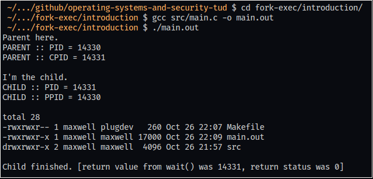
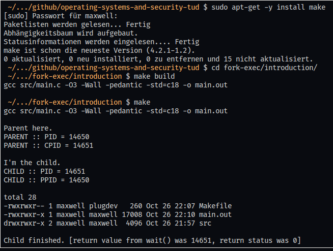

# 

## Operating Systems and Security

_An addition to the OPAL forum with proper support for code highlighting and issues. This repository is meant for computer science students (and others) INF-B-380. Fully unofficial._

### Rationale

This repository exists to work around the rather poor **formatting**, **syntax highlighting** and **issue reporting** support on the OPAL platform. It is meant to be accessible to every student who is interested in the topic, wants to learn more or discuss issues he or she ran into. Moreover, tutors are welcome to look into this too.

This will also provide anyone _unfamiliar_ with a shell (the command line) with _some_ experience.

**Remember** that this is **completely unofficial**.

### If you're interested

This repository is set-up to enable everyone to clone and work with it. Every piece of code is free to use and alter under the Apache 2.0 license. If you'd like to contribute, open a PR. If you have a question with regard to code in this repository, open an issue.

### An Example

The first topic of interest added here is about [`fork-exec`][fork-exec::wikipedia]. A few small examples were written to illustrate the process. We will take the first one and discuss what examples should look like and what their educational purpose is.

Each directory has a certain structure so it's _easy_ to work consistently.

``` Bash
fork-exec/
├── introduction/
│   ├── Makefile
│   └── src
│       └── main.c
└── zombies/
    ├── Makefile
    ├── README.md
    └── src
        └── main.c
```

In this example, we will need to navigate to `fork-exec/introduction`. Open a terminal in this repository. You should now be in the root of this repository. Use `cd fork-exec/introduction` to get to the introductory example.

You can now compile the program yourself with `gcc src/main.c -o main.out`, or use the provided `Makefile`. If you want to use `make`, you can install it - on Ubuntu, that's `sudo apt-get -y install make`. You will then be able to build the program by executing `make build`. Running just `make` will execute the program.

Let's try it without `make` first:



Now with make:



***That's it***. Now have a look at the source code yourself and see what happens. For some examples, there is a dedicated `README.md` in each directory which explains the case presented in more detail.

[fork-exec::wikipedia]: https://en.wikipedia.org/wiki/Fork%E2%80%93exec

### Currently Present Cases

1. `fork-exec` :: Introduction
2. `fork-exec` :: Zombies
3. `fork-exec` :: Task 1.13 Base Template
4. `fork-exec` :: Task 1.15 with init-wrapper
