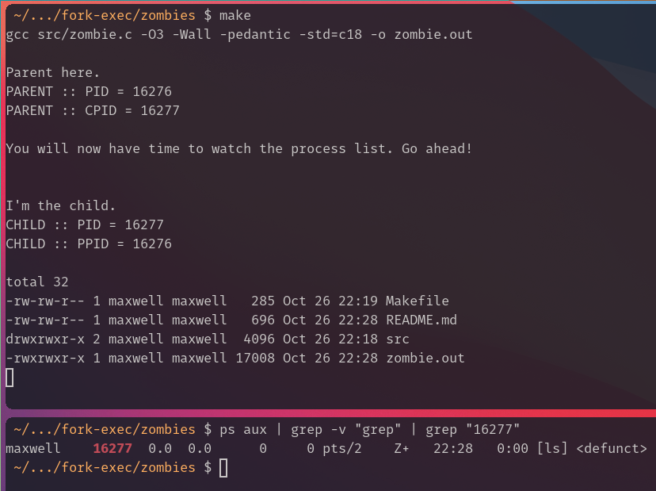

# Zombie Processes

The main difference compared to the introductory example is that we're just `sleep`ing in the parent while our child executes and actually finishes. As we're **not** waiting for it, the child will remain in this exited status and become a _zombie_.

## What's a zombie?

Asking Google yields a [wikipedia entry][zombie_process::wikipedia]:

_The term zombie process derives from the common definition of zombie — an undead person. In the term's metaphor, the child process has "died" but has not yet been "reaped". Also, unlike normal processes, the kill command has no effect on a zombie process._

## What To Do

1. **Manually**: Run the compiler with `gcc src/zombie.c -o zombie.out` and execute it yourself with `./zombie.out`.
2. **Semi-Automated**: Execute `make`.

You will then have 50 seconds of time to watch the process list. Open a new terminal. You can use the following command to search for your zombie-process:

``` BASH
ps aux | grep -v "grep" | grep "<CHILD PID>"
```

which looks like this:



The process you see is _defunct_, a zombie so to say.

## Why do we need to sleep?

You can remove the `sleep` statement and try again. This time, of course, the parent exits immediately. What's up with the child now? [Wikipedia][zombie_process::wikipedia] will serve us well here too:

_Zombie processes should not be confused with orphan processes: an orphan process is a process that is still executing, but whose parent has died. When the parent dies, the orphaned child process is adopted by init (process ID 1). When orphan processes die, they do not remain as zombie processes; instead, they are waited on by init. The result is that a process that is both a zombie and an orphan will be reaped automatically._

To summarize, our process becomes orphaned since its parent died. As it is a zombie and an orphan, the `init` process (you can find this specimen with `ps aux | grep -v "grep" | grep "/sbin/init"` under Ubuntu) will become the new parent a`wait`ing it, effectively reaping (bringing it to an end) it. You will therefore no longer be able to see it in the process list.

[zombie_process::wikipedia]: https://en.wikipedia.org/wiki/Zombie_process
